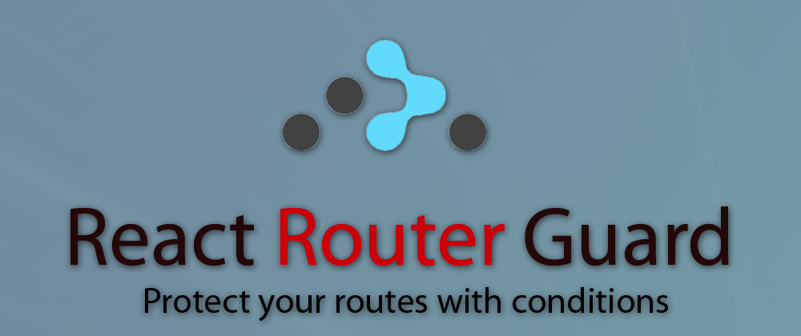
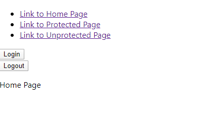

# Course Checkpoint 16

## Porque utilizamos Rutas de Guardia?



Siempre que desarrolle una aplicación React, será necesario restringir a los usuarios no autenticados el acceso a ciertas partes de su aplicación.
React Router es mi biblioteca de elección cuando se trata de enrutamiento para React, pero no hay una forma incorporada de proteger un < Route > del acceso sin restricciones. En este post te mostraré cómo construir fácilmente tus propias rutas vigiladas.

### Configuración de una aplicación de ejemplo

Primero ejecuta npx create-react-app route-guard en tu línea de comandos para arrancar una nueva React-Application.

La segunda ejecución npm comienza dentro de la carpeta route-guards recién creada para comprobar si todo funciona correctamente.

Como resultado, debería ver la página predeterminada create-react-app en su navegador:


### Configuración de algunas < Routes > para proteger

Ahora instalamos React Router ejecutando npm install react-router-dom, para configurar algunas rutas básicas que protegemos más adelante.

Además, configurar tres nuevos componentes React a los que podemos enrutar:

Home.js
```JavaScript
import React from 'react';

function Home(){
    return(
        <p>Home Page</p>
    );
}

export default Home;
```

Protected.js
```JavaScript
import React from 'react';

function Protected(){
    return(
        <p>Protected Page</p>
    );
}

export default Protected;
```

Unprotected.js
```JavaScript
import React from 'react';

function Unprotected(){
    return(
        <p>Unprotected Page</p>
    );
}

export default Unprotected;
```

Importe el BrowserRouter en su componente App.js y configure un < Router > con dos rutas.

Tus App.js deberían verse así:

App.js
```JavaScript
import React from 'react';
import {BrowserRouter as Router, Route, Switch} from 'react-router-dom';
import Protected from './Protected';
import Unprotected from './Unprotected';

function App() {
  return (
    
    <Router>
      <Switch>
        <Route path='/protected' component={Protected}/>
        <Route path='/unprotected' component={Unprotected}/>
      </Switch>
    </Router>

  );
}

export default App;
```

En un siguiente paso mostramos tres enlaces dentro del componente App.js para navegar fácilmente de una página a otra.

Importe Link desde react-router-dom y agregue las siguientes líneas a la parte superior del componente < Router > de su aplicación:

```HTML
<div>
   <ul>
       <li>
         <Link to='/'>
           Link to Home Page
         </Link>
       </li>
       <li>
         <Link to='/protected'>
           Link to Protected Page
         </Link>
       </li>
       <li>
         <Link to='/unprotected'>
           Link to Unprotected Page
         </Link>
       </li>
  </ul>
</div>
```

De este modo se completa la configuración básica, ahora podemos investigar la autenticación y cómo proteger una < Route >.

### Agregar autenticación falsa

Antes de que podamos agregar la protección de rutas, debemos agregar una autenticación falsa.

Debajo de la Navegación añadimos un botón Login y un Logout con un onClickhandler que apunta a las funciones correspondientes que definimos justo en la parte superior del componente.

Utilizamos useStatehook para guardar el estado de inicio de sesión de usuario actual dentro del estado del componente.

El componente App.js ahora debería verse así:

```JavaScript
import React, { useState } from 'react';
import { BrowserRouter as Router, Route, Switch, Link } from 'react-router-dom';
import Protected from './Protected';
import Unprotected from './Unprotected';
import Home from './Home';

function App() {
    const[isAutheticated, setisAutheticated] = useState(false);

  function login(){
    setisAutheticated(true);
    console.log("loggedInUser:" + isAutheticated)
  }

  function logout(){
    setisAutheticated(false);
    console.log("loggedInUser:" + isAutheticated)
  }
  
  return (
    <Router>
      <div>
        <ul>
          <li>
            <Link to='/'>
              Link to Home Page
          </Link>
          </li>
          <li>
            <Link to='/protected'>
              Link to Protected Page
          </Link>
          </li>
          <li>
            <Link to='/unprotected'>
              Link to Unprotected Page
          </Link>
          </li>
        </ul>
        <button onClick={login}>Login</button>
        <br/>
        <button onClick={logout}>Logout</button>
      </div>
      <Switch>
        <Route exact path='/' component={Home}/>
        <Route path='/protected' component={Protected} />
        <Route path='/unprotected' component={Unprotected} />
      </Switch>
    </Router>

  );
}

export default App;
```

### Ruta de protección al componente protegido

Ahora queremos proteger la página protegida del acceso sin restricciones de los usuarios.
Necesitamos escribir un GuardedRoute que envuelva un React-Router normal < Route >:

```JavaScript
import React from 'react';
import { Route, Redirect } from "react-router-dom";

const GuardedRoute = ({ component: Component, auth, ...rest }) => (
    <Route {...rest} render={(props) => (
        auth === true
            ? <Component {...props} />
            : <Redirect to='/' />
    )} />
)

export default GuardedRoute;
```

Ahora podemos usar el nuevo componente dentro del componente App.js.

```JavaScript
<GuardedRoute path='/protected' component={Protected} auth {isAutheticated} />
```

Permítanme explicar el código anterior:

En primer lugar creamos un nuevo componente envolviendo un React-Router < Route >. A continuación, cambiamos el nombre de la prop de componente a Componenteporque en JSX los nombres de etiqueta en minúsculas se consideran etiquetas HTML, por lo que los nombres de componente siempre deben empezar en mayúsculas. Dentro del render del componente < Router > comprobamos si el usuario está autenticado. Si es true, muestra el componente protegido. Si es false redirigimos a Home.js.

Ahora hemos terminado con la implementación. Reinicie la aplicación y pruebe las diferentes < Rutas >. No debería ser posible alcanzar el componente protegido si no está conectado. Si intenta llegar a la página protegida, la aplicación redirige a la página principal.



## Que es una solicitud POST?


El método HTTP POST envía datos al servidor. El tipo del cuerpo de la solicitud es indicada por la cabecera Content-Type.

La diferencia entre PUT y POST es que PUT es idempotente: llamarlo una o varias veces sucesivamente tiene el mismo efecto (no tiene efecto secundario // colateral), mientras que varios POST idénticos pueden tener efectos adicionales, como pasar una orden muchas veces.

Una solicitud POST es tipicamente enviada por un formulario HTML y resulta en un cambio en el servidor. En este caso, el tipo de contenido es seleccionado poniendo la cadena de texto adecuada en el atributo enctype del elemento < form > o el atributo formenctype de los elementos < input > o < button > :

- application/x-www-form-urlencoded: Los valores son codificados en tuplas llave-valor separadas por '&', con un '=' entre la llave y el valor. Caracteres no-Alfanumericos en ambas (llaves, valores) son percent encoded: Esta es la razón por la cual este tipo no es adecuado para usarse con datos binarios (use multipart/form-data en su lugar)
- multipart/form-data: Cada valor es enviado como un dato de bloque ("input de un formulario"), con un delimitador como separador definido por el usuario ("espacio entre campos"). Éstas llaves son colocadas en el Content-Disposition , la cual es cómo está estructurada cada parte del HEADER en una petición HTTP
- text/plain

Cuando la solicitud POST es enviada por otro método distinto a un formulario HTML — por ejemplo mediante una XMLHttpRequest — el cuerpo puede aceptar cualquier tipo. Como se describe en la especificación HTTP 1.1, el método POST está diseñado para permitir un método uniforme que cubra las siguientes funciones:

- Modificación de recursos existentes.
- Publicar un mensaje en un tablón de anuncios, grupo de noticias, lista de correos, o grupos similares de artículos;
- Agregar un nuevo usuario a través de un modal de suscripciones;
- Proveer un conjunto de datos, como resultado del envío de un formulario, a un proceso data-handling.
- Extender una base de datos a través de una operación de concatenación.

### Sintaxis

```HTTP
POST /index.html
```

### Ejemplo

Un formulario simple empleando el tipo de contenido por defecto application/x-www-form-urlencoded:

```HTTP
POST / HTTP/1.1
Host: foo.com
Content-Type: application/x-www-form-urlencoded
Content-Length: 13

say=Hi&to=Mom
```

Un formulario usando el tipo de contenido multipart/form-data:

```HTTP
POST /test.html HTTP/1.1
Host: example.org
Content-Type: multipart/form-data;boundary="boundary"

--boundary
Content-Disposition: form-data; name="field1"

value1
--boundary
Content-Disposition: form-data; name="field2"; filename="example.txt"

value2
```

## Qué es un Portfolio y porque es importante tener uno?


Portafolio es un grupo de casos de diseño que demuestra los skills, la experiencia y el conocimiento del diseñador. El objetivo de la cartera es presentar al diseñador a los ojos del nuevo cliente a través de los casos de clientes con los que el diseñador ha trabajado anteriormente. La cartera tiende a poner obras frescas que ayudan al diseñador a presentarse de la mejor manera. El diseñador debe entender la diferencia entre los archivos de diseño y la cartera de diseño.

### ¿Con qué frecuencia tienes que actualizar tu cartera?

Generalmente, la cartera se formaliza en el momento de buscar nuevos clientes. El tiempo pasa y el diseñador se ve obligado a poner en cartera, en primer lugar, obras frescas. Ellos son los que lo venderán. Si el diseñador pone trabajos antiguos en la cartera, no le ayudará a obtener una ventaja sobre los diseñadores más recientes. Es por esta razón que los jóvenes diseñadores suelen superar a los diseñadores más experimentados.

### ¿Qué tienes que poner en la cartera?

Es habitual agrupar la cartera en la especialidad principal de diseñador. Por supuesto, es posible encontrar una cartera de diseñadores multifuncionales. Pero tales carteras pueden perder frente a especialistas en diseño altamente especializados. Hay veces que un diseñador bajo un cliente específico agrupa trabajos favoritos.

### ¿Cuál es la diferencia entre una cartera y un archivo de diseño?

Portafolio es una presentación con una descripción de exactamente lo que el diseñador estaba haciendo, cómo se articulaba la tarea en el proyecto y así sucesivamente. El archivo de diseño es una colección de todas las obras de toda la vida del diseñador. No hay necesidad de poner todo-todo el trabajo en la cartera, ya que las obras antiguas pueden más bien perjudicar al diseñador, por lo que caen fuera del diseño moderno y no satisfacen las expectativas de los clientes.

### Portafolio es un manifiesto

A través de la cartera, el diseñador no solo presenta sus trabajos, tanto como muestra lo flexible, abierto, interesado, cargado que es el diseñador. A través del estilo de diseño de la cartera se puede transmitir la modernidad del autor de la cartera. Infundir confianza en el cliente de que es precisamente el diseñador que se necesita en un proyecto valiente.

### Cartera como búsqueda de empleo

En el momento de buscar trabajo, el diseñador tiende a agrupar los trabajos en una especialidad de diseño específica (a veces incluso bajo un cliente específico) para caer en las expectativas del empleador.

### Cartera moderna

La cartera de diseño debe consistir generalmente en obras de diseño modernas. Así lo demuestra el diseñador como especialista que estudia a fondo el mundo renovador y las tendencias de diseño. Es probable que el diseñador que sigue diseñando interfaces en los viejos marcos de IU pierda en demanda.

### Cuáles son las carteras

La cartera no solo se puede encontrar en diseñadores. El portafolio lo recogen también arquitectos, redactores y otros especiales del arte. La cartera puede tener un conjunto de casos absolutamente diferente y el posicionamiento del diseñador.

### ¿A qué preguntas del cliente debe responder la cartera?

- ¿Qué sabe este diseñador?
- ¿Qué esquillas tiene el diseñador?
- ¿Qué nivel de clientes tiene el diseñador?
- ¿Qué hacía específicamente el diseñador en un proyecto determinado?
- ¿A- qué se dedicó el proyecto al que el diseñador fue invitado?

### ¿Qué preguntas debe responder el diseñador al porftolio?

- ¿A qué cliente quiero ir (la industria)?
- ¿Qué nivel de presupuesto de mis clientes?
- ¿Cómo abre el cliente mi cartera? ¿Está disponible?
- ¿Se aferran las previsualizaciones de los casos a ver para un estudio más profundo de la cartera?
- ¿Cuánto tiempo pasa un cliente estudiando mi cartera?
- ¿Quién evaluará mi cartera: empleador, HR, director de arte o propietario de un negocio? ¿Qué puede resultar importante para ellos en la evaluación de la cartera?
- ¿Puedo decirte exactamente lo que hice en los proyectos?
- ¿Cómo voy a revelar el trabajo en equipo en el proyecto?
- ¿Qué posibilidades de diseño se presentan a través de la cartera?
- ¿Hay suficientes esquillas que reflejen mi cartera?
- ¿El storotelling y el diseño de la cartera será capaz de transmitir mi wib (mi estado de ánimo, mi profesionalismo)?
- ¿Cómo puedo decir los casos que están bajo NDA?
- ¿Debería publicar portafolios en Bolsas, entre diseñadores competidores? ¿Tengo riesgo de perder un cliente allí?
- ¿Necesito mostrar recomendaciones de clientes anteriores en mi cartera?

### ¿Es obligatorio tener una cartera?

Si un diseñador es demandado y popular entre los clientes, entonces no tiene necesidad de crear una cartera. Sus proyectos de trabajo y network entre diseñadores hacen un gran trabajo en lugar de una cartera. La regla de oro funciona: lo importante no es quién conoces, sino quién te conoce.

### ¿Cuáles son los «pecados mortales» en la preparación de la cartera?

- Envíe su cartera como un enlace en discos en la nube. El cliente simplemente no los verá, ya que simplemente no tiene tiempo para arrastrarse por todas las carpetas del diseñador.
- Ignorar el pensamiento previo. Si la vista previa no se aferra, el cliente no estudiará más a fondo la cartera.
- No especificar contactos. ¿Cómo puede un cliente ponerse en contacto con usted sin contactos?
- No especifique al menos una descripción mínima del caso de diseño. Por regla general, los clientes siempre leen los requisitos entrantes y lo que el diseñador hizo exactamente en el proyecto.

## Que es Linkdn?


LinkedIn es la mayor red profesional online a nivel mundial. Puedes utilizar LinkedIn para encontrar el trabajo o las prácticas perfectas, conectar y fortalecer las relaciones profesionales, y aprender las aptitudes necesarias para tener éxito en tu carrera profesional. Puedes acceder a LinkedIn desde un escritorio, una aplicación móvil de LinkedIn o una experiencia web móvil.

Un perfil de LinkedIn completo puede ayudar a conectar con oportunidades, ya que muestra tu historial profesional a través de la experiencia, las aptitudes y la educación.
También puedes usar LinkedIn para organizar eventos presenciales, unirte a grupos, escribir artículos, publicar fotos y vídeos, y mucho más.

### ¿Quién debería unirse a LinkedIn?

LinkedIn es una plataforma para cualquier persona que esté buscando avanzar en su carrera. Esto puede incluir personas de diversos ámbitos profesionales, como propietarios de pequeñas empresas, estudiantes y personas en búsqueda de empleo. Los miembros de LinkedIn pueden usar LinkedIn para adentrarse en una red de profesionales, empresas y grupos de su sector y más.

### ¿Cómo empiezo a usar LinkedIn?

LinkedIn es una plataforma en línea que conecta a profesionales de todo el mundo. A continuación, te explicamos cómo formar parte de LinkedIn:
1. Crea tu perfil: registrarse y crear tu perfil es la mejor forma de empezar a usar LinkedIn. Un perfil de LinkedIn completo resume tu experiencia profesional a tus contactos y posibles empresas y técnicos de selección de personal. A través de tu perfil, puedes mostrar tu vida profesional, hitos, habilidades e intereses.
2. Crea tu red: tu red es crucial a la hora de aprovechar el potencial de LinkedIn. Te ayudará comprender lo que está sucediendo en tu sector y tu círculo profesional. Puedes empezar agregando a tu familia, amigos, compañeros de clase actuales y antiguos y compañeros de trabajo a tu red. También puedes seguir a personas, empresas o temas accediendo directamente a la página Sigue nuevas perspectivas, que te muestra fuentes recomendadas para que las sigas. Puedes usar la función Eventos de LinkedIn para crear y unirte a eventos profesionales, como talleres en línea, seminarios, eventos de ventas y marketing, eventos de redes y más.
3. Encuentra un empleo: si estás buscando una nueva oportunidad profesional, puedes empezar tu búsqueda de empleo en LinkedIn. Puede utilizar LinkedIn para descubrir empresas y ponerte en contacto con la comunidad de contratación. También puedes enviar directamente una solicitud para un puesto vacante, guardar búsquedas de empleo y notificar a tus contactos y a los técnicos de selección de personal que deseas recibir oportunidades de empleo.
4. Participa en conversaciones: puedes participar en conversaciones en LinkedIn. Participar en conversaciones te permite compartir tu opinión con los demás sobre asuntos y temas relevantes. Puedes recomendar y comentar publicaciones y artículos en LinkedIn. Puedes crear o unirte a un nuevo grupo de LinkedIn para conectarte y establecer relaciones con otros miembros que comparten tus intereses, experiencias o aspiraciones. También puedes utilizar un conjunto de pequeñas expresiones llamadas reacciones LinkedIn, para comunicarte fácilmente con tu red.
5. Publica contenido: millones de usuarios vienen a LinkedIn cada día para conectar, aprender y compartir. Puedes alentar y educar a tu círculo profesional con el contenido que publiques en LinkedIn. También puedes compartir tus pensamientos e ideas con los usuarios de LinkedIn mediante el recuadro para compartir.

### Servicio gratuito de LinkedIn vs. suscripciones de pago

LinkedIn ofrece una cuenta básica gratuita a cualquier usuario que desee crear y mantener un perfil profesional en línea.

Si actualizas a una suscripción Premium, obtendrás acceso a más productos y características de LinkedIn. Nuestras suscripciones de pago incluyen productos de marketing, selección de personal, ventas y aprendizaje. Puedes probar una suscripción Premium de LinkedIn gratuitamente durante un mes.

Obtén más información acerca de las cuentas gratuitas y las suscripciones Premium de LinkedIn.

## Porque deberíamos tener un perfil en Linkdn?

https://www.linkedin.com/in/max252

Tu perfil de LinkedIn es una página de destino profesional donde puedes gestionar tu marca personal. Un perfil de LinkedIn es la mejor forma de que la gente te conozca, sepa qué te importa y qué te interesa. Tu perfil es un panel personal en el que las personas pueden encontrarte y estar al tanto de tu actividad, así que asegúrate de que esté completo y te represente.

Todos los miembros de LinkedIn que se conecten a LinkedIn.com o a nuestras aplicaciones pueden ver tu perfil completo. No obstante, puedes controlar qué aparece en tu perfil, qué notificaciones se comparten con tu red y tus preferencias de privacidad del perfil.

Tener un perfil en LinkedIn te ayuda a:

- Gestionar tu marca profesional: puedes definir y determinar la forma en la que los demás ven tu experiencia profesional y cualificaciones. Como puedes controlar por completo tu perfil y su visibilidad, puedes personalizarlo para que se adapte a tus necesidades. Un perfil personalizado ayudará a los técnicos de selección de personal y a otros miembros a conocer tu personalidad profesional.
- Crear oportunidades: como las personas y las empresas de todo el mundo utilizan LinkedIn, un perfil de LinkedIn te ayudará a destacar. Un perfil actualizado es la forma ideal de garantizar que te encontrarán las personas adecuadas en el momento preciso. Además, es una forma excelente de encontrar oportunidades de empleo y conectar con técnicos de selección de personal. Cuando hayas completado tu perfil, estarás mejor preparado para encontrar empleo en LinkedIn.
- Crear tu red y hacer un seguimiento de tus hitos profesionales: puedes mostrar todos tus logros profesionales (nuevo empleo, aniversario de trabajo, ascenso, etc.) en tu perfil de LinkedIn. Te ayudará a mostrar tu experiencia profesional y tus logros a los miembros que ven tu perfil. Un perfil actualizado te abre la puerta a conocer a nuevos miembros y añadir contactos.

Puedes añadir varias secciones al perfil para mostrar tus habilidades y experiencia. Un perfil de LinkedIn completo aumentará las posibilidades de que te encuentren y las apariciones de tu perfil en las búsquedas.

Consejos para crear un buen perfil de LinkedIn:

Añadir una foto de perfil profesional: una buena foto de perfil aumentará la credibilidad de tu perfil y te ayudará a destacar entre la multitud. Los miembros con una foto de perfil en LinkedIn reciben hasta 2 veces más visualizaciones de perfil. Además, puedes añadir una imagen de fondo para personalizar tu perfil. Consulta más consejos para seleccionar la foto de perfil de LinkedIn correcta.

Hacer que tu titular destaque: tu titular se crea cuando añades puestos de trabajo a tu perfil. No obstante, puedes reescribirlo para promocionar un área de especialización o destacar tu personalidad.

- Escribir un resumen: la sección Acerca de de tu perfil debe expresar tu objetivo, tu motivación y tus habilidades a las personas que ven tu perfil. Lo ideal es que el texto de esta sección ocupe de uno a dos párrafos. Puedes emplear puntos de enumeración si no se te da bien redactar. Consulta algunos de los resúmenes de perfil de LinkedIn que más nos gustan.
- Añade todos tus empleos y formación relevantes: debes mantener el perfil actualizado con todas las experiencias profesionales acordes con tus objetivos profesionales actuales. Además, puedes agregar ejemplos de contenido multimedia para proporcionar un acceso rápido a tu portfolio de trabajo.
- Añadir aptitudes relevantes: una lista de aptitudes relevantes en el perfil te ayudará a mostrar tus aptitudes a otros miembros, ya sean compañeros de trabajo o técnicos de selección de empleo. Ayuda a los demás a conocer tus puntos fuertes. Cuando hayas añadido tus aptitudes, tus contactos pueden validarlas. Cuando alguien valida tus aptitudes, aumenta la probabilidad de que te descubran para oportunidades relacionadas con tus aptitudes. Además, puedes hacer evaluaciones de las aptitudes que has incluido en tu perfil para mostrar tus competencias.
- Solicitar recomendaciones a tus contactos: una recomendación sirve para reconocer o elogiar a un contacto, ya sea un compañero de trabajo, un socio o un estudiante. No hay ningún límite en el número de recomendaciones que puedes solicitar. Cuando aceptas una recomendación de un contacto, se hace visible para tu red de forma predeterminada. También puedes ocultar recomendaciones si crees que no se adaptan a tus objetivos profesionales.
- Utiliza el medidor de eficacia del perfil para medir la eficacia de tu perfil.

Cuando hayas creado y actualizado diferentes secciones del perfil, puedes empezar a compartir tu perfil público con una red más amplia. Tu perfil público es una versión simplificada del perfil completo de LinkedIn que se muestra en los motores de búsqueda y que aparece visible para todo el mundo. Puedes promocionar tu perfil para que aparezca mejor posicionado en los resultados de un motor de búsqueda si creas una URL personal. Además, puedes crear una insignia para tu perfil público y añadirla a tu currículum vítae en línea, blog o sitio web desde la página Configuración del perfil público.

